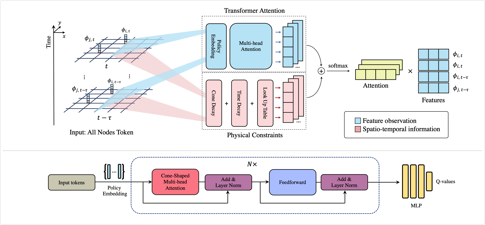
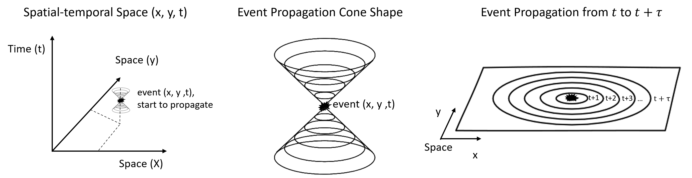
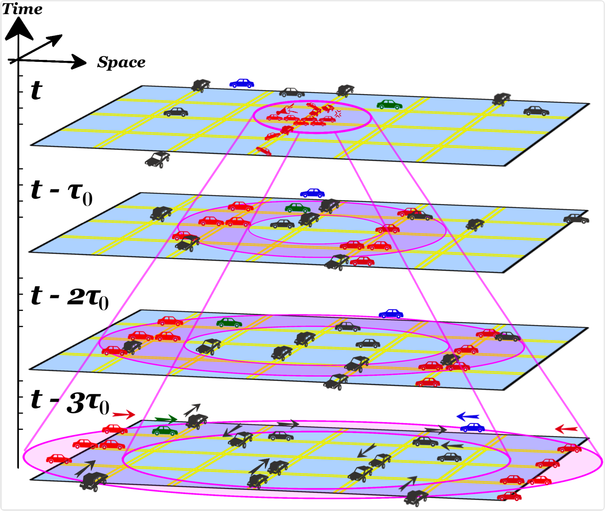

# Delayed Propagation Transformer: A Universal Computation Engine towards Practical Control in Cyber-Physical Systems
## Introduction

Multi-agent control is a central theme in the Cyber-Physical Systems (CPS). However, current control methods either receive non-Markovian states due to insufficient sensing and decentralized design, or suffer from poor convergence. This paper presents the Delayed Propagation Transformer (DePT), a new transformer-based model that specializes in the global modeling of CPS while taking into account the immutable constraints from the physical world. DePT induces a cone-shaped spatial-temporal attention prior, which injects the information propagation and aggregation principles and enables a global view. With physical constraint inductive bias baked into its design, our DePT is ready to plug and play for a broad class of multi-agent systems. The experimental results on one of the most challenging CPS -- network-scale traffic signal control system in the open world -- demonstrated the superior performance of DePT on synthetic and real-world datasets.

## Method








## Installation Guide

The RL training loop of this repo is inherited from Colight repo: https://github.com/wingsweihua/colight

### First, create new environment

This step is optional. CoLight (teacher model for DePT with imitation learning) requires tensorflow==1.x.

```
conda create -y -n <your_env_name> python=3.6
conda activate <your_env_name>
```

### Then, install cityflow

Follow the [[Official installation guide]](https://cityflow.readthedocs.io/en/latest/install.html#install)

Or optionally, use the following commands without docker (docker is recommended but not mandatory)

```
git clone https://github.com/cityflow-project/CityFlow.git
cd CityFlow
pip install .
```

To test if you have successfully installed cityflow, check if the following python codes can pass without error:

```
import cityflow
eng = cityflow.Engine
```

### Then, install requirements for teacher Colight 

The RL training loop of DePT is based on Colight, they share the same dependencies. A complete environment that passed the test is provided in `DePT/requirements.txt`.

## Training Guide

#### First, train teacher Colight:

set `use_DePT = False` in DePT/config.py, then run` main.py`

#### Second, pre-fit attention prior

Initialize model and pre-fit the priors using `/DePT/DePT_src/pretrain_decayer.py`

If downgrading DePT to transformer and not using the spatial tempooral cone shaped prior, skip this step.

#### Before training, keep track of the following configurations for training DePT:

If training a colight teacher model, set `use_DePT = False` in `DePT/config.py: DIC_COLIGHT_AGENT_CONF`. If training the DePT model, set it to False.

If enabling the spatial temporal cone shaped prior (default is enabled), set the following in `DePT/model.py`.

```
ablation1_cone = False
ablation2_time = False
only_1cone = False
```

If using Colight as the teacher model, set ` which_teacher='colight'` in `DePT/DePT_src/model.py`, and set `colight_fname` to the pre-trained Colight teacher `.h5` file.

#### Train DePT:

##### Example commands

```
python main.py 

python main.py --cnt 3600  --rounds 100  --gen 4  

python main.py --cnt 3600  --rounds 100  --gen 5  --volume='newyork' --road_net='28_7' --suffix='real_triple'
```

#### parameter meaning: 

--rounds will specify the number of rounds generated, each round is 1 hour simulation time; 100 rounds are recommended.

--gen will specify number of generators; all generators work in parallel. 1 to 5 are recommended.

#### Simulation Platform that passed the test:

Ubuntu 20.04.2

RTX A6000

Driver Version: 460.91.03  CUDA Version: 11.2

### Optional step before training:

Delete the following dirs (Automatically generated files) won't cause error in training, except losing your redundant training histories.

```
rm -rf model 
rm -rf records
```

# Citation

```
comming soon.
```


